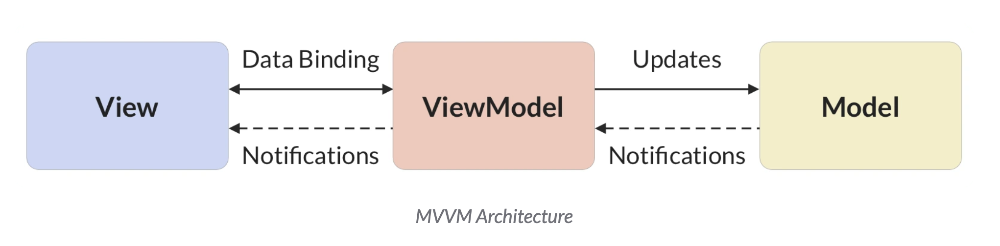

# Tune Catcher

>
> record, learn, and master traditional folk tunes ❤️ 🪕

## Development

### Generated Code

To generate companion classes to go along with `drift` tables, we use the dart `build_runner` dev requirement. This bash command you can set up in a terminal on the side and just leave on. It will watch for changes and make updates to the companion classes accordingly.

```bash
dart run build_runner watch
```

### Linting Standards

- The line `package:lint/strict.yaml` in `analysis_options.yaml` adds some opinionated Dart linting standards so we can have consistent styles in our codebase and help us learn good syntax for this new language. 😊
- The VSCode `markdownlint` extension gives some easy auto-formatting (Option+Shift+F): [https://marketplace.visualstudio.com/items?itemName=DavidAnson.vscode-markdownlint](https://marketplace.visualstudio.com/items?itemName=DavidAnson.vscode-markdownlint)

### Database location

Finding the database to clear it is a bit of a pain. In the future, a 'clear' database button could be added, or a flag or some other switch to toggle the use of an in-memory database. 
For you copy-and-paste convenience, on MacOS this should work to clear the database:

``` sh
rm "$HOME/Library/Containers/com.example.tuneCatcher/Data/Library/Application Support/com.example.tuneCatcher/my_database.sqlite"
```

## Goals

- [ ] Tune List
  - [ ] store tunes
  - [ ] fetch data about tunes from tune repositories (names, ABC of different versions, key, type, etc.)
  - [ ] provide practicing assistance for committing tunes to memory
  - [ ] associate the tune entries with sections of recordings
- [ ] Set lists
  - [ ] create set lists that reference tunes from tune list
  - [ ] provide practicing assistance for committing sets to memory and practicing transitions
- [ ] Recorder
  - [ ] record audio
  - [ ] (stretch goal) identify tunes
- [ ] Recording list
  - [ ] track personal recordings
  - [ ] track recordings from remote sources like Spotify and YouTube
  - [ ] associate those recordings with tunes from tune list

## Architecture

### Conceptual layout

```text
Presentation layer    
┌─────────────────────┐
│                     │
│   Widgets           │
│                     │
│   States            │
│                     │
│   Controllers       │
│                     │
└─────────┬───────────┘
          │            
          │            
          ▼            
 Application Layer     
┌─────────────────────┐
│                     │
│ Services            │
│                     │
└─────────────────────┘
          ▲            
          │            
          │            
  Data layer           
┌─────────────────────┐
│                     │
│  Model              │
│                     │
│  Database           │
│                     │
└─────────────────────┘
```

### Architectural layout

By separating the business logic from the user interface, we can prevent direct code dependence of business logic on UI elements. The ViewModel presents a programming interface for separaring the data manipulation and modification concerns from UI elements that are rendered, interacted with, and updated.

By separating the business logic from the data contained in the model itself, we simplify the code that represents the data to just CRUD operations on the data we manage.



Source: [Code with Andrea](https://codewithandrea.com/articles/comparison-flutter-app-architectures/)

References:

- <https://www.xavor.com/blog/bloc-vs-riverpod/>
- <https://codewithandrea.com/articles/flutter-app-architecture-riverpod-introduction/>
- <https://riverpod.dev/>
- <https://github.com/fluttergems/awesome-open-source-flutter-apps>
